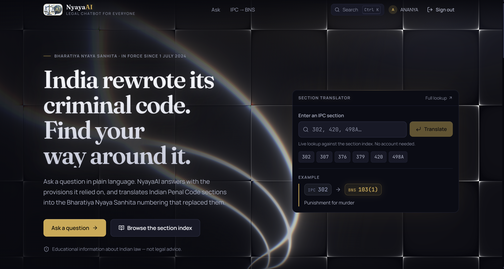
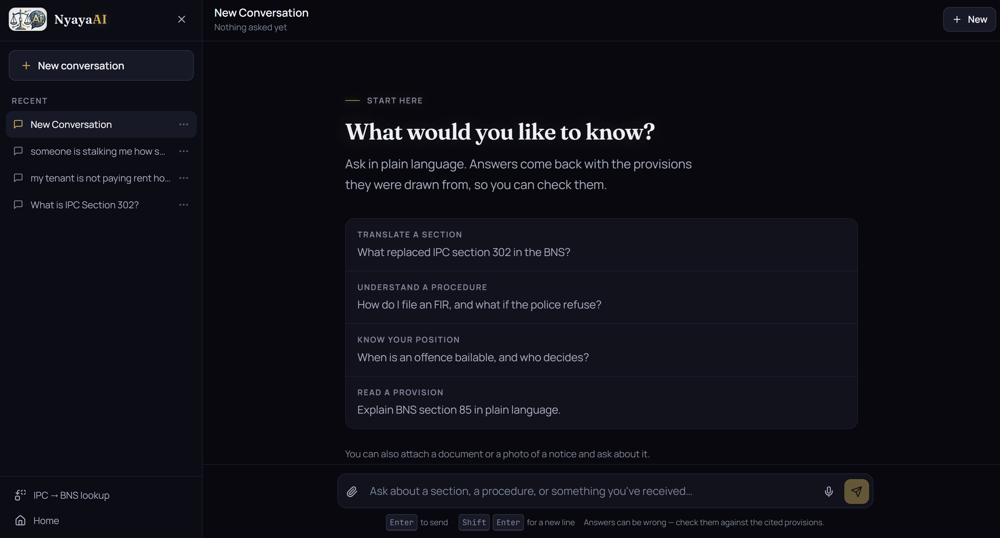
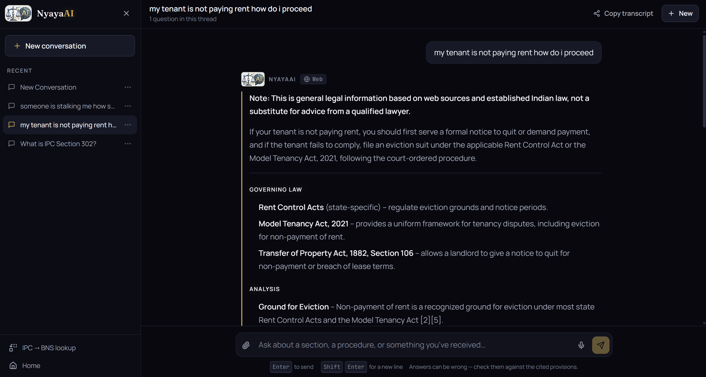
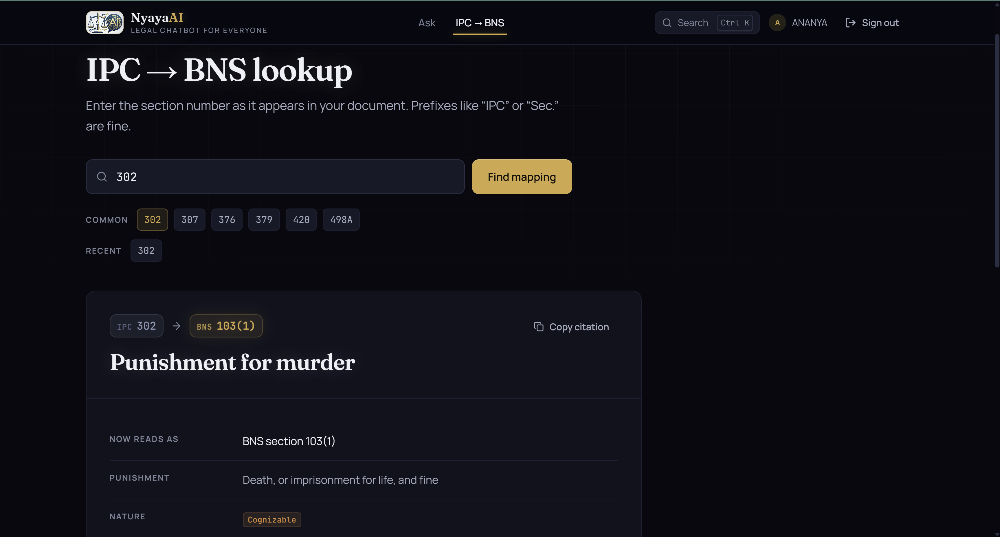

# NyayaAI — AI Legal Assistant for Indian Law

> Navigate the Bharatiya Nyaya Sanhita (BNS), Indian Penal Code (IPC), and allied statutes with AI-powered, citation-backed answers.

---

## Overview

NyayaAI is a full-stack legal assistant that helps citizens, students, and professionals understand Indian law in plain language. It uses a **hybrid RAG pipeline** (BM25 + semantic search) grounded in verified statute text, with automatic IPC-to-BNS section mapping.

### Key Features

| Feature | Description |
|---|---|
| **Legal Q&A** | Ask questions in natural language; get answers grounded in actual statute text with section citations |
| **IPC ↔ BNS Mapping** | Instantly translate between old IPC and new BNS section numbers |
| **Document Analysis** | Upload PDFs, DOCX, or text files and get legal analysis of their contents |
| **Image Understanding** | Attach screenshots of legal notices or documents for AI interpretation |
| **Web Search Fallback** | When the knowledge base can't answer, the system searches authoritative Indian legal sources |
| **Voice Input** | Dictate your legal questions using browser speech recognition |
| **Multi-session Chat** | Persistent chat history with rename, pin, archive, and branch |

---

## Architecture

```
┌──────────────┐     ┌──────────────────────────────────┐     ┌──────────────┐
│   React SPA  │────▶│  FastAPI Backend                 │────▶│   Qdrant     │
│  (Vite)      │     │  ├─ /chat  (SSE streaming)       │     │  (vectors)   │
│              │◀────│  ├─ /map   (IPC → BNS)           │     └──────────────┘
│  Components: │     │  ├─ /auth  (JWT + bcrypt)        │
│  - Chat      │     │  ├─ /extract (PDF/DOCX → text)   │     ┌──────────────┐
│  - Mapping   │     │  └─ /health (deep health check)  │────▶│  PostgreSQL  │
│  - Landing   │     │                                  │     │  (users)     │
│  - Auth      │     │  LLM Chain:                      │     └──────────────┘
└──────────────┘     │  Groq → Gemini (auto-fallback)   │
                     └──────────────────────────────────┘
```

### Tech Stack

- **Frontend**: React 19, Vite, Tailwind CSS, Framer Motion
- **Backend**: FastAPI, Python 3.11+
- **Database**: PostgreSQL (Neon) — SQLite fallback for development
- **Vector DB**: Qdrant Cloud
- **LLMs**: Groq (primary) → Gemini (fallback), with automatic model chain
- **CI/CD**: GitHub Actions (lint → test → build → docker)

---
## Preview

| Home Page | New Chat Window |
|------|------|
|  |  |

| Query | IPC to BNS Lookup |
|------|------|
|  |  |

---

---

## Quick Start

### Prerequisites

- Python 3.11+
- Node.js 18+
- Docker & Docker Compose (for containerized deployment)

### 1. Clone and configure

```bash
git clone https://github.com/RahullSainii/NyayaAI.git
cd NyayaAI
cp .env.example .env
# Edit .env with your API keys and database credentials
```

### 2. Run with Docker (recommended)

```bash
docker-compose up --build
```

This starts Qdrant (`:6333`), the backend (`:8000`), and nginx (`:80`).

### 3. Run locally (development)

**Backend:**
```bash
pip install -r backend/requirements.txt
uvicorn backend.main:app --reload --port 8000
```

**Frontend:**
```bash
cd frontend
npm install
npm run dev
```

---

## Environment Variables

| Variable | Required | Description |
|---|:---:|---|
| `JWT_SECRET` | ✅ | Random secret for JWT signing (min 32 chars) |
| `GROQ_API_KEY` | ✅ | Primary LLM provider |
| `GEMINI_API_KEY` | ⬡ | Fallback LLM + vision model |
| `QDRANT_URL` | ✅ | Qdrant instance URL |
| `QDRANT_API_KEY` | ⬡ | Qdrant Cloud API key |
| `DATABASE_URL` | ⬡ | PostgreSQL connection string (falls back to SQLite) |
| `FRONTEND_ORIGIN` | ✅ | CORS allowed origin for production |
| `VITE_API_BASE_URL` | ✅ | Backend URL for the frontend to call |
| `ADMIN_API_KEY` | ⬡ | Key to access `/ingest` endpoint |
| `TAVILY_API_KEY` | ⬡ | Tavily search API (best web search quality) |
| `SERPER_API_KEY` | ⬡ | Serper Google search API |

> ✅ = required for production &nbsp; ⬡ = optional / has fallback

See [`.env.example`](.env.example) for the full list with defaults.

---

## API Endpoints

| Method | Path | Auth | Description |
|---|---|:---:|---|
| `GET` | `/health` | ❌ | Deep health check (API + Qdrant + DB) |
| `POST` | `/chat` | ✅ | Streaming legal Q&A (SSE) |
| `GET` | `/map?ipc=302` | ❌ | IPC → BNS section mapping |
| `POST` | `/extract` | ✅ | Extract text from PDF/DOCX uploads |
| `POST` | `/ingest` | 🔑 | Re-index PDFs from `data/` |
| `POST` | `/auth/register` | ❌ | Create account |
| `POST` | `/auth/login` | ❌ | Login (returns JWT) |
| `POST` | `/auth/refresh` | ✅ | Refresh JWT |
| `POST` | `/auth/google` | ❌ | Google OAuth login |
| `POST` | `/auth/forgot-password` | ❌ | Send password reset email |
| `POST` | `/auth/reset-password` | ❌ | Reset password with token |

> ✅ = JWT required &nbsp; 🔑 = Admin API key required

---

## Testing

```bash
# Backend tests
pip install -r backend/requirements-dev.txt
pytest

# Frontend tests
cd frontend
npm run test
```

---

## Deployment

### Render (recommended for free tier)

| Service | Type | Config |
|---|---|---|
| Backend | Web Service (Docker) | Dockerfile: `Dockerfile.backend` |
| Frontend | Static Site | Build: `npm ci && npm run build`, Publish: `dist` |
| Database | Neon PostgreSQL | Set `DATABASE_URL` env var |
| Vector DB | Qdrant Cloud | Set `QDRANT_URL` + `QDRANT_API_KEY` |

> **Important**: Set `CORS_ALLOW_LOCALHOST=false` in production.

---

## Project Structure

```
NyayaAI/
├── backend/
│   ├── llm/              # LLM package (client, prompts, streams, citations)
│   ├── main.py            # FastAPI app, routes, middleware
│   ├── auth.py            # JWT auth, registration, password reset
│   ├── retriever.py       # Hybrid BM25 + vector search
│   ├── config.py          # Environment config with validation
│   ├── web_search.py      # Multi-provider web search fallback
│   ├── extraction.py      # PDF/DOCX text extraction
│   └── requirements.txt
├── frontend/
│   ├── src/
│   │   ├── pages/         # Chat, Landing, AuthPage, Mapping
│   │   ├── components/    # ChatSidebar, ChatInputArea, ChatBubble, etc.
│   │   ├── context/       # AuthContext (JWT management)
│   │   └── lib/           # Centralized API layer
│   └── vite.config.js
├── tests/                 # pytest integration tests
├── data/                  # PDF source documents for ingestion
├── docker-compose.yml     # Full-stack container orchestration
├── Dockerfile.backend     # Multi-stage, non-root backend image
├── Dockerfile.frontend    # Multi-stage nginx frontend image
├── nginx.conf             # Production nginx with security headers
└── .github/workflows/     # CI pipeline
```

---

## License

[MIT](LICENSE)